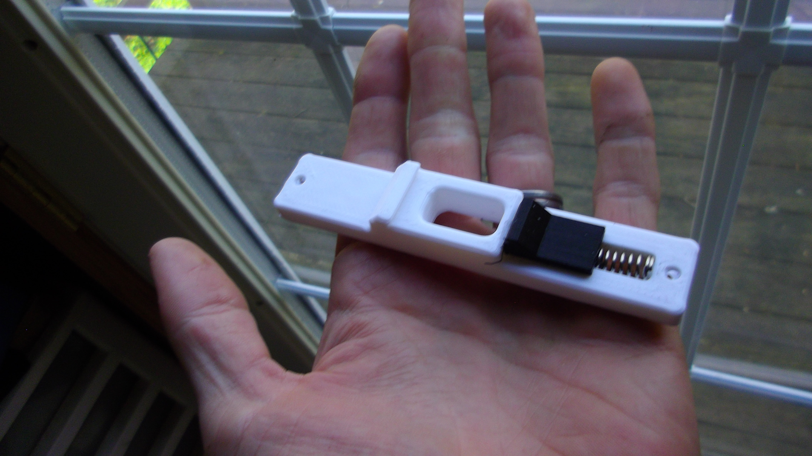
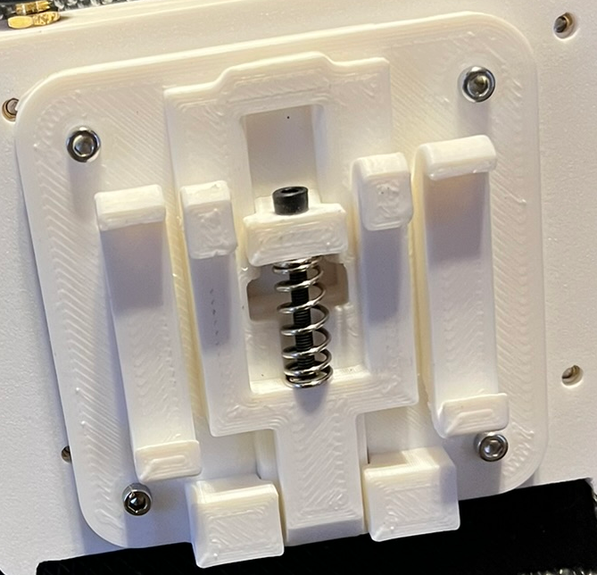

# Din mounts that don't suck
## Here you'll find a couple simple spring loaded DIN3 (35mm rail) mounts. Please don't use these in any commercial or critical application. They have no ratings, and I take no responsibility for any use of them. 

# The springs used are just Ender3 stock bed springs. You can get a 100 pack off amazon for around $11. Specs are
- 20mm length
- 8mm outer diameter
- 1mm wire diameter
- 8-10 turns

# The mounting holes are 4.5mm, for 3mm heat set inserts. I've provided the step files so that you can modify the mounts to fit whatever you want.

## I designed the wider clip for my [jetson enclosures](https://github.com/obfuscated-D/jetson-enclosures). Check that one out if you need an enclosure for a jetson nano original, or a jetson orin nano dev kit!
